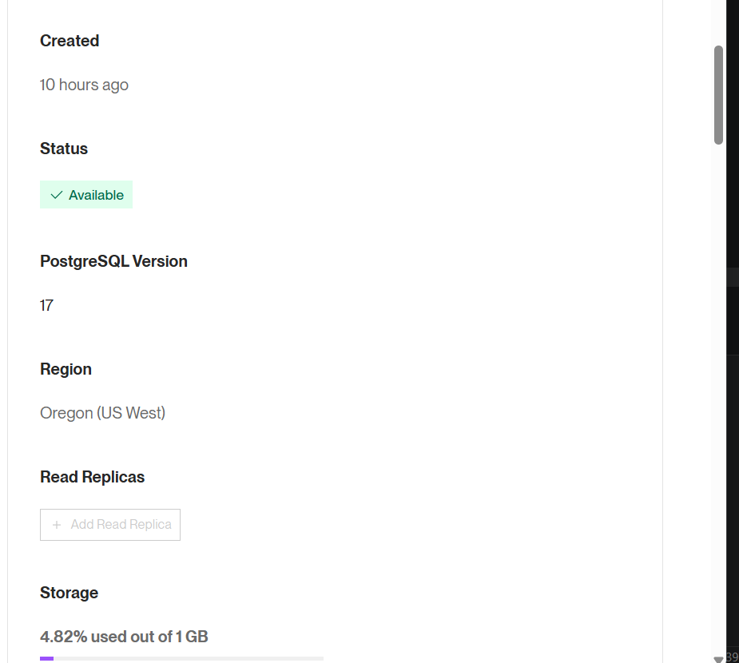
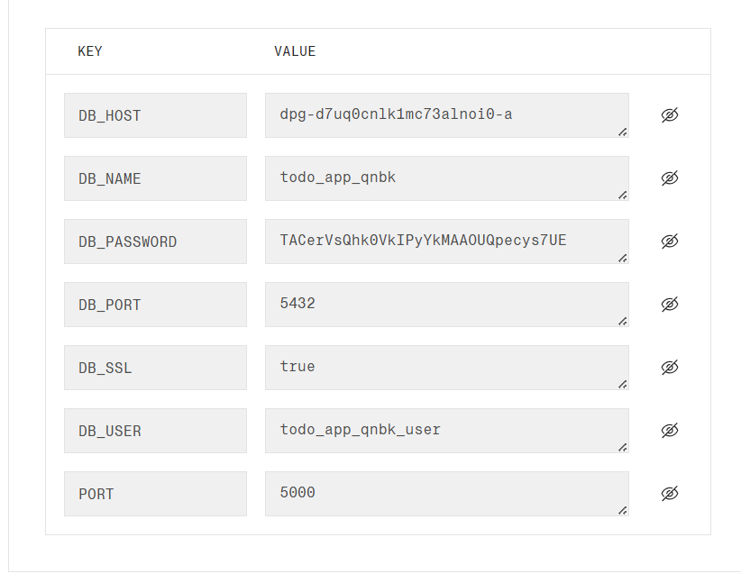
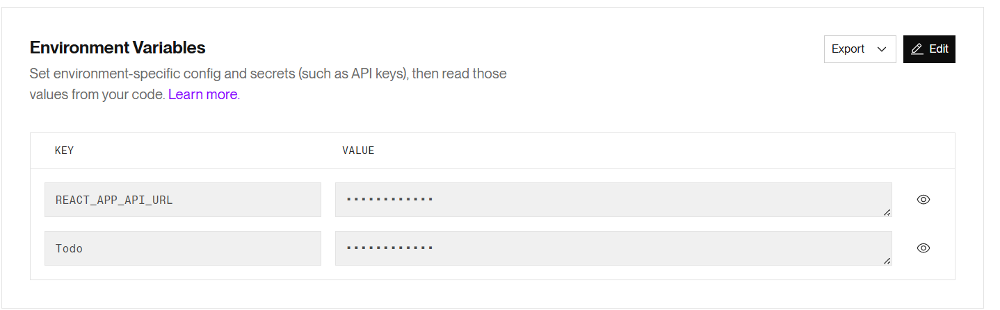

# Assignment 1 – Docker Deployment on Render.com
**Course:** DSO101 – Continuous Integration and Continuous Deployment  
**Student ID:** 02250390  
**Submission Date:** 12th March

---

## Objective

Build and push Docker images for the frontend and backend to Docker Hub, then deploy both services with a managed PostgreSQL database on Render.com. This covers two deployment approaches: using a pre-built image (Part A) and automated build-from-Git with a `render.yaml` blueprint (Part B).

---

## Part A – Pushing Pre-Built Images to Docker Hub

### Step 1 – Build the Backend Image

Inside the `backend/` directory, the following Dockerfile was used:

```dockerfile
FROM node:18-alpine
WORKDIR /app
COPY package*.json ./
RUN npm install
COPY . .
EXPOSE 5000
CMD ["node", "server.js"]
```

Build and push commands (student ID used as the image tag):

```bash
docker build -t 02250390/be-todo:02250390 ./backend
docker push 02250390/be-todo:02250390
```


---

### Step 2 – Build the Frontend Image

```bash
docker build -t 02250390/fe-todo:02250390 ./frontend
docker push 02250390/fe-todo:02250390
```


---

### Step 3 – Deploy on Render.com

**Backend Service:**
- Created a Web Service → selected "Existing image from Docker Hub"
- Image: `02250390/be-todo:02250390`
- Set the following environment variables in Render's dashboard:

| Key | Value |
|-----|-------|
| `DB_HOST` | *(Render PostgreSQL host)* |
| `DB_USER` | *(Render DB user)* |
| `DB_PASSWORD` | *(Render DB password)* |
| `DB_NAME` | `todo` |
| `PORT` | `5000` |

**Frontend Service:**
- Created a Web Service → selected "Existing image from Docker Hub"
- Image: `02250390/fe-todo:02250390`
- Set the following environment variable:

| Key | Value |
|-----|-------|
| `REACT_APP_API_URL` | `https://be-todo.onrender.com` |

**Database:**
- Used Render's managed PostgreSQL service.
- The connection credentials from Render's PostgreSQL dashboard were used to populate the backend environment variables above.







---

## Part B – Automated Build and Deployment from Git

### Configure `render.yaml`

The following blueprint was added at the repository root to orchestrate multi-service deployment. Every push to `main` triggers Render to rebuild and redeploy both services automatically.

```yaml
services:
  - type: web
    name: be-todo
    env: docker
    dockerfilePath: ./backend/Dockerfile
    envVars:
      - key: DB_HOST
        value: your-render-db-host
      - key: PORT
        value: 5000

  - type: web
    name: fe-todo
    env: docker
    dockerfilePath: ./frontend/Dockerfile
    envVars:
      - key: REACT_APP_API_URL
        value: https://be-todo.onrender.com
```

---

## Challenges Faced

- **Build-time vs runtime env vars for React:** `REACT_APP_API_URL` must be available at build time for Create React App, not just at runtime. This required making sure the variable was set in the Dockerfile build args or `.env.production` before the image was built.
- **Database initialisation timing:** The backend attempted to connect before PostgreSQL was fully ready on the first deploy. This was resolved by ensuring the `init.sql` schema was applied via Render's managed DB rather than relying on a startup script.
- **Image tag convention:** The assignment required the student ID as the image tag, which differed from the typical `latest` tag workflow.

## Learning Outcomes

- Understood how to build and push Docker images to a container registry using a consistent tagging convention.
- Learned the difference between deploying a pre-built image versus triggering a build from source on Render.
- Gained hands-on experience configuring `render.yaml` for multi-service deployments, which is conceptually similar to `docker-compose.yml` but targets cloud infrastructure.
- Understood the importance of managing environment variables securely — never committing `.env` files to Git.