# Assignment 2 – Jenkins CI/CD Pipeline
**Course:** DSO101 – Continuous Integration and Continuous Deployment  
**Student ID:** 02250390  
**Submission Date:** 25th March

---

## Objective

Configure a Jenkins pipeline to automate the build, test, and deployment of the todo list application. The pipeline covers code checkout from GitHub, dependency installation, build, unit testing with Jest, and a deployment stage.

---

## Task 1 – Jenkins Setup

### Installing Jenkins

- Downloaded Jenkins from [jenkins.io/download](https://jenkins.io/download) and ran it locally at `http://localhost:8080`.
- Completed the initial setup wizard and installed the suggested default plugins.

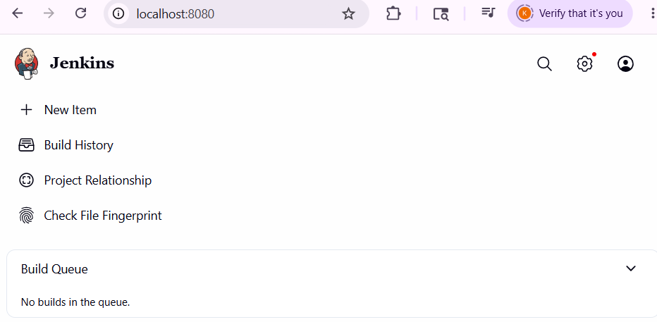

### Installing Required Plugins

Navigated to **Manage Jenkins → Plugins → Available** and installed:

| Plugin | Purpose |
|--------|---------|
| NodeJS Plugin | Enables `npm` commands in pipeline |
| Pipeline | Declarative pipeline support |
| GitHub Integration | Connects Jenkins to GitHub repos |
| Docker Pipeline | Enables Docker steps in pipeline |

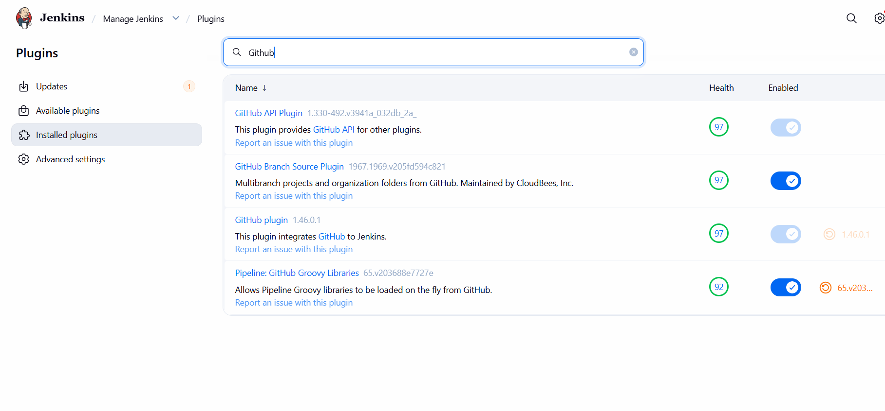
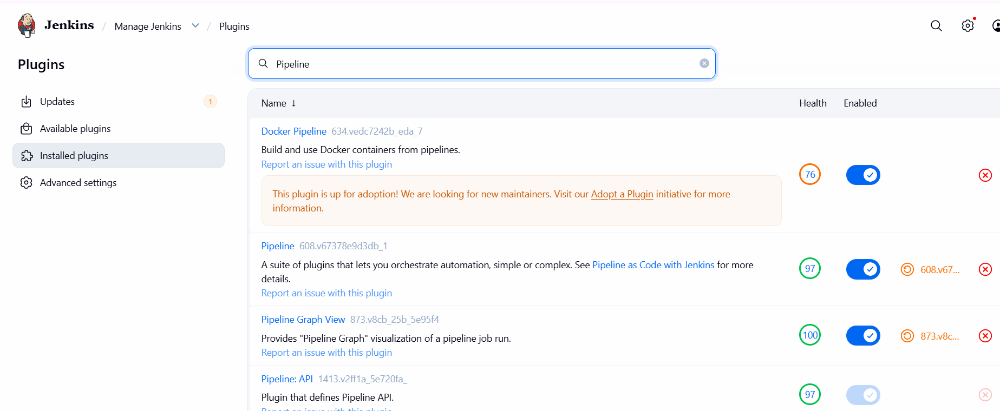
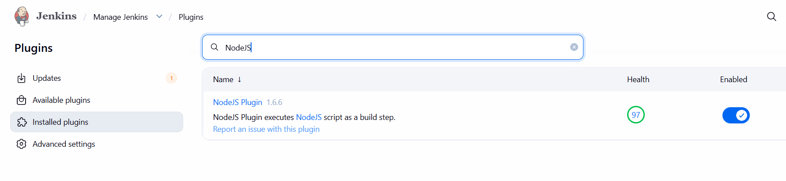

### Configuring Node.js

- Went to **Manage Jenkins → Tools → NodeJS**
- Added a NodeJS installation named `NodeJS` using LTS v20.x
- Jenkins auto-installs it when the pipeline first runs

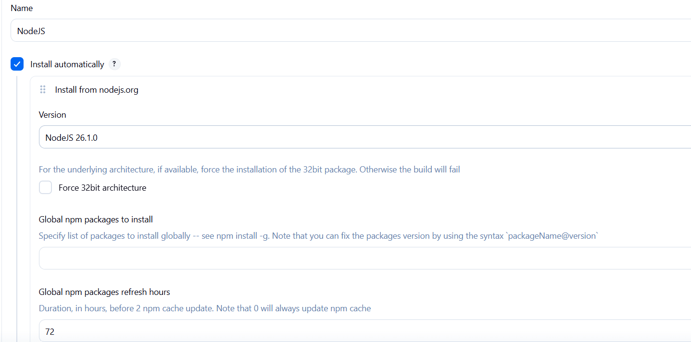

---

## Task 2 – GitHub Repository Setup

### Generating a Personal Access Token (PAT)

1. Went to **GitHub → Settings → Developer Settings → Personal Access Tokens**
2. Created a new token with `repo` and `admin:repo_hook` permissions
3. Copied the token immediately (it is only shown once)

### Adding GitHub Credentials to Jenkins

1. Went to **Manage Jenkins → Credentials → (global) → Add Credentials**
2. Set Kind to **Username with Password**
   - Username: GitHub username
   - Password: the PAT generated above
3. Saved with a recognisable ID (e.g. `github-pat`)

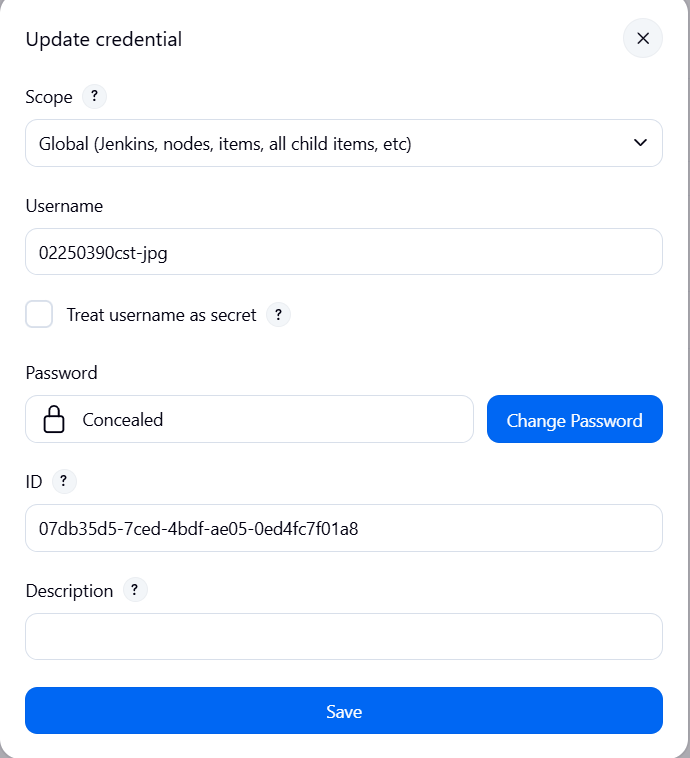

---

## Task 3 – Jenkinsfile

A `Jenkinsfile` was created at the repository root with the following pipeline definition:

```groovy
pipeline {
    agent any

    tools {
        nodejs 'NodeJS'
    }

    stages {

        stage('Checkout') {
            steps {
                checkout scm
            }
        }

        stage('Install') {
            steps {
                bat 'npm install'
            }
        }

        stage('Build') {
            steps {
                bat 'npm run build'
            }
        }

        stage('Test') {
            steps {
                bat 'npm test'
            }
            post {
                always {
                    junit 'junit.xml'
                }
            }
        }

        stage('Deploy') {
            steps {
                echo 'Deploy step complete!'
            }
        }
    }
}
```

> **Note:** `bat` is used instead of `sh` because the Jenkins agent runs on Windows. On a Linux agent, replace all `bat` with `sh`.

### Jest Configuration for JUnit Reports

To make Jenkins display test results, `jest-junit` was installed and the test script was updated:

```bash
npm install --save-dev jest-junit
```

`package.json` test script:

```json
"scripts": {
  "test": "jest --ci --reporters=default --reporters=jest-junit"
}
```

This outputs a `junit.xml` file that Jenkins reads via the `junit` post step.

---

## Task 4 – Running the Pipeline

### Creating the Pipeline Job

1. In Jenkins, clicked **New Item → Pipeline**
2. Named it `todo-app-pipeline`
3. Under **Pipeline**, set:
   - Definition: **Pipeline script from SCM**
   - SCM: **Git**
   - Repository URL: `https://github.com/<username>/todo-app`
   - Credentials: selected the GitHub PAT credential
   - Branch: `*/main`
   - Script Path: `Jenkinsfile`
4. Clicked **Save**

### Running the Build

- Clicked **Build Now**
- Monitored progress in the **Stage View** and **Console Output**

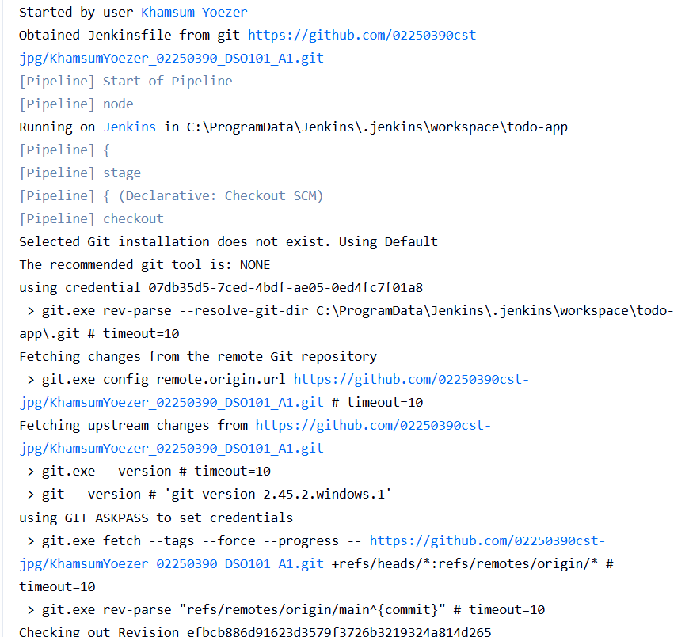
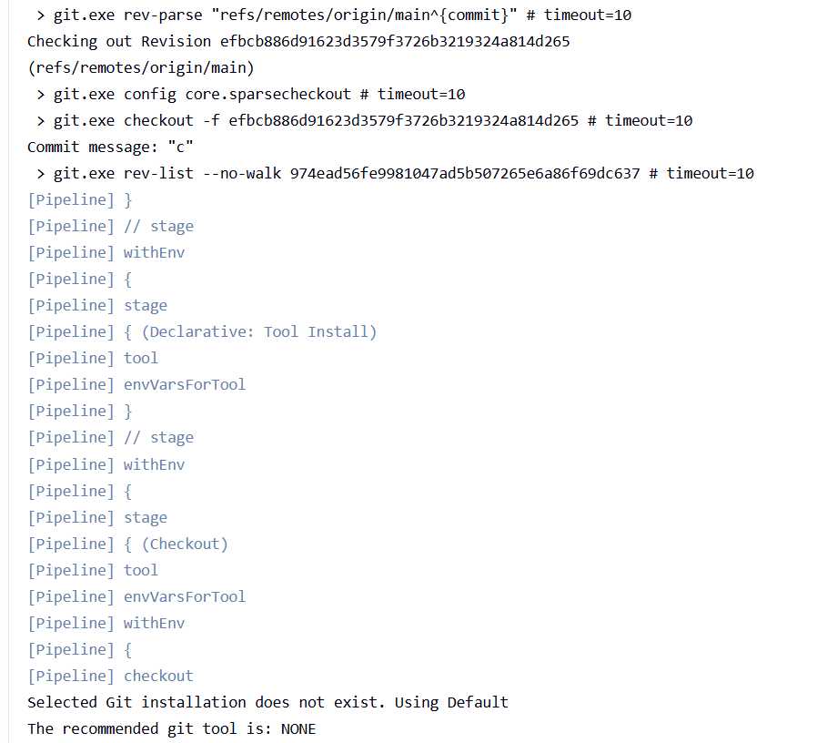
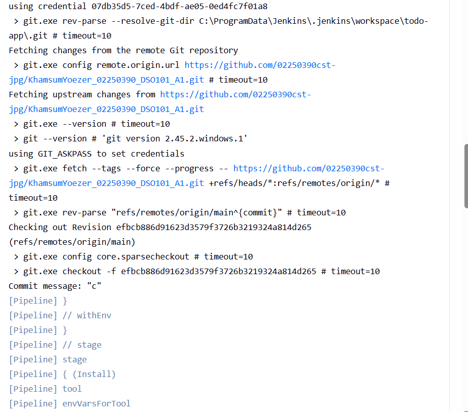
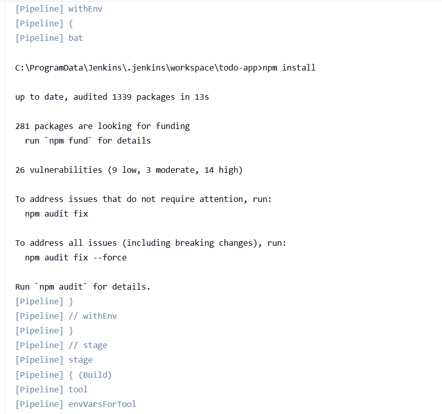
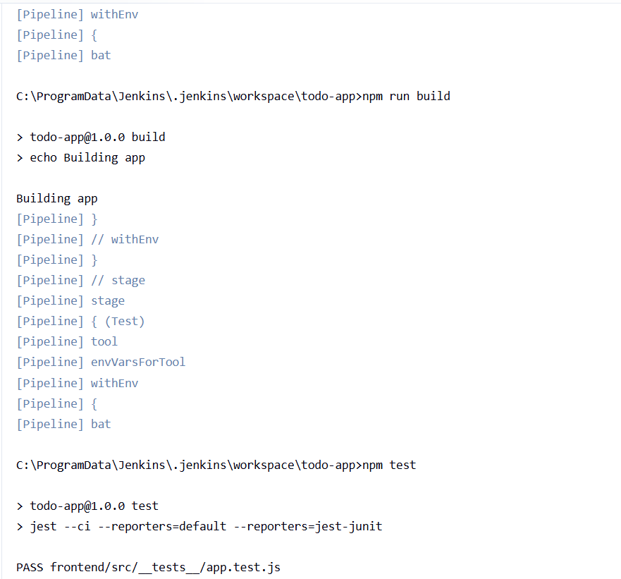
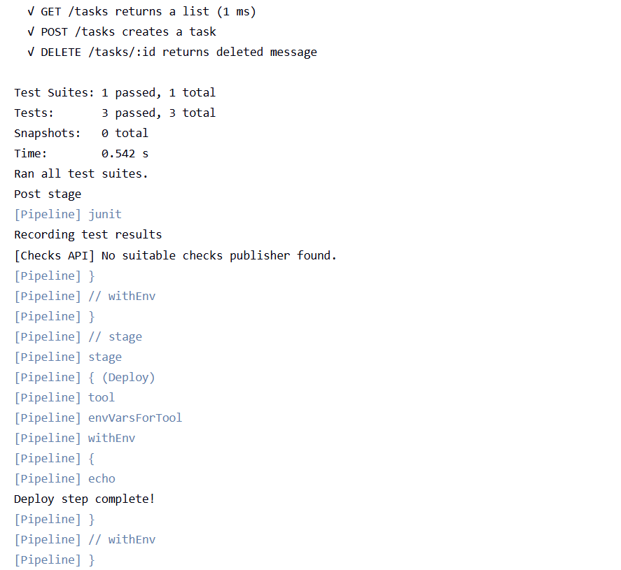

---

## Expected Output

**Console output confirms:**
- ✅ Checkout: code pulled from GitHub `main` branch
- ✅ Install: `npm install` completes with no errors
- ✅ Build: `npm run build` produces a production build
- ✅ Test: Jest runs all test cases, `junit.xml` generated
- ✅ Deploy: echo confirms deployment stage reached

**Test Results tab in Jenkins:**
- Shows individual test cases from `junit.xml`
- Pass/fail counts visible per build

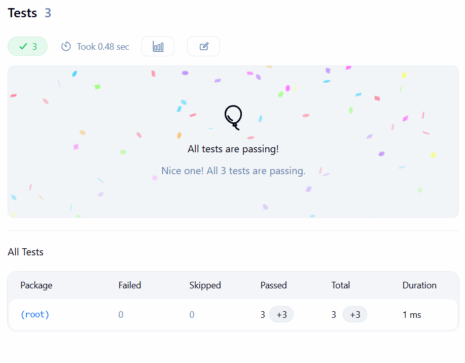 

---

## Challenges Faced

- **Windows vs Linux commands:** Jenkins was running on a Windows machine, so `sh` commands from the assignment examples had to be changed to `bat`. This was discovered when the first build failed with a "sh not found" error.
- **JUnit report not found:** The `junit 'junit.xml'` step initially failed because jest was not generating the report. Adding `jest-junit` and updating the test script resolved this.
- **Node path not detected:** Jenkins didn't detect `npm` on the first run because the NodeJS tool name in the Jenkinsfile (`'NodeJS'`) had to exactly match the name configured under Manage Jenkins → Tools.

## Learning Outcomes

- Understood the structure of a declarative Jenkins pipeline and how each stage maps to a real step in the development workflow.
- Learned how to connect Jenkins to a GitHub repository using a PAT and trigger builds from SCM.
- Gained experience configuring test reporters (jest-junit) to produce machine-readable results that CI tools like Jenkins can parse and display.
- Understood the difference between running pipelines on Windows vs Linux agents and how to write portable pipeline code.