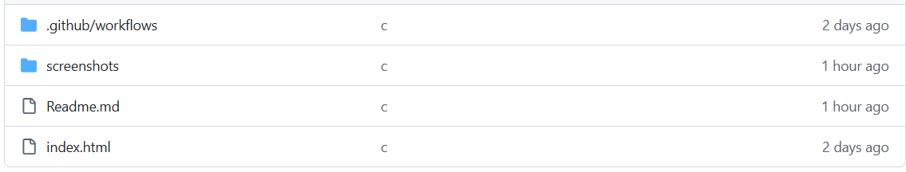
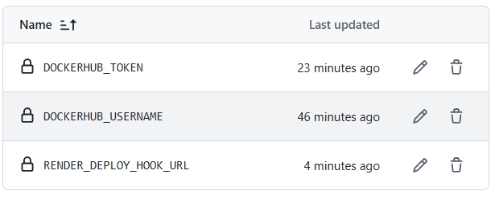
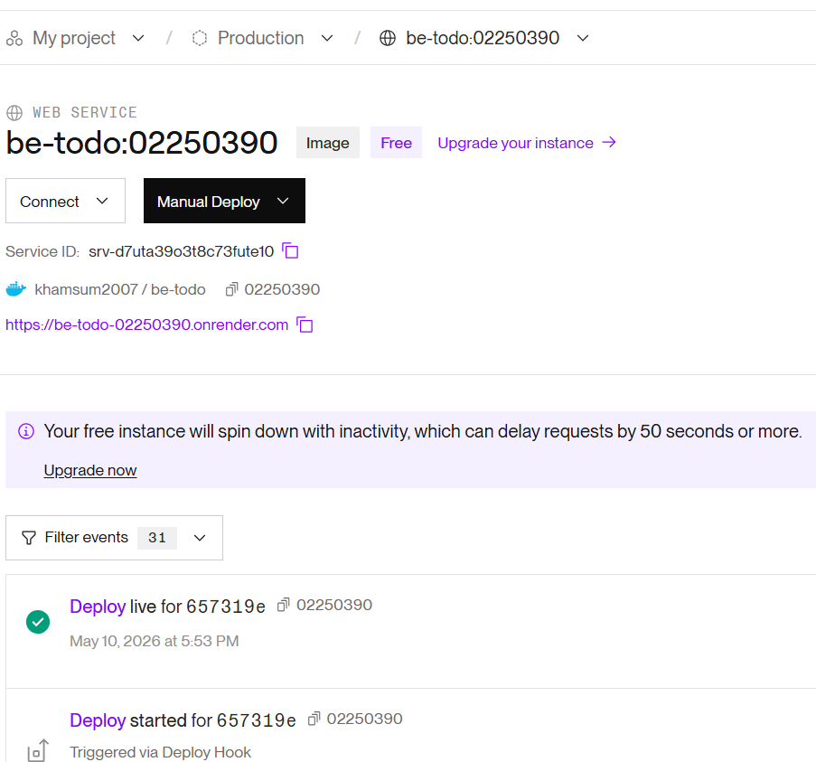
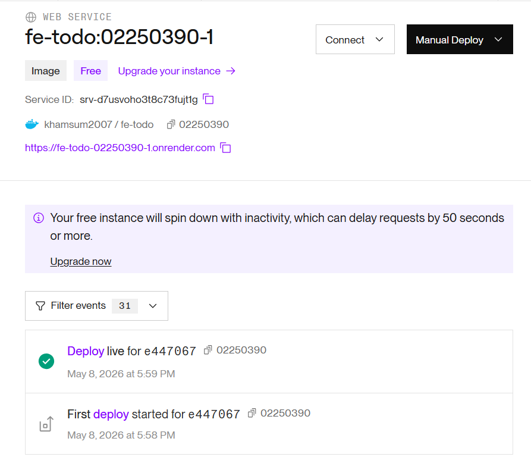
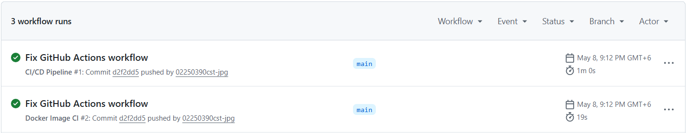
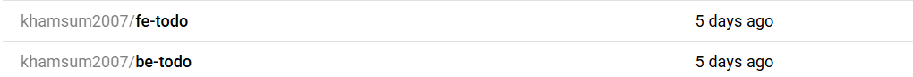
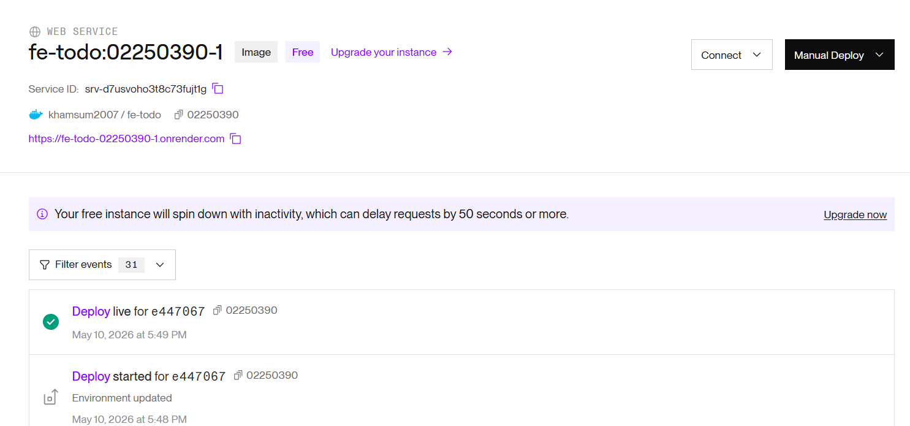
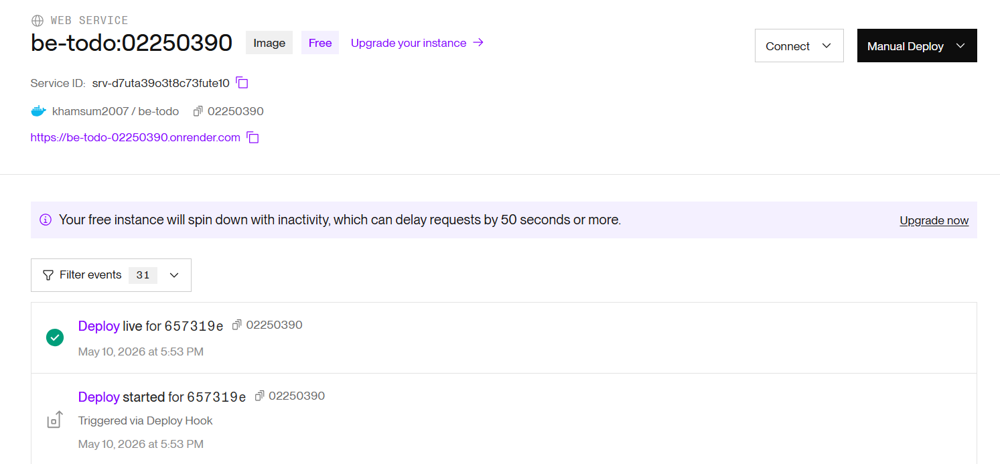

# Assignment 3 – GitHub Actions CI/CD
**Course:** DSO101 – Continuous Integration and Continuous Deployment  
**Student ID:** 02250390  
**Submission Date:** 29th April

---

## Objective

Configure a GitHub Actions workflow that automatically builds Docker images for the frontend and backend, pushes them to Docker Hub, and triggers a redeployment on Render.com — all on every push to the `main` branch.

---

## Task 1 – Repository Verification

Before setting up the workflow, the following was confirmed:

- The repository is **public** on GitHub
- `package.json` contains the required scripts:

```json
"scripts": {
  "start": "node server.js",
  "build": "react-scripts build",
  "test": "jest --ci --reporters=default --reporters=jest-junit"
}
```

 

---


## Task 2 – GitHub Actions Workflow

Created the file `.github/workflows/deploy.yml` at the repository root:

```yaml
on:
  push:
    branches: ["main"]

jobs:
  build-and-deploy:
    runs-on: ubuntu-latest
    steps:
      - name: Checkout Repository
        uses: actions/checkout@v4

      - name: Login to DockerHub
        uses: docker/login-action@v3
        with:
          username: ${{ secrets.DOCKERHUB_USERNAME }}
          password: ${{ secrets.DOCKERHUB_TOKEN }}

      - name: Build and Push Backend Image
        run: |
          docker build -t ${{ secrets.DOCKERHUB_USERNAME }}/be-todo:latest ./backend
          docker push ${{ secrets.DOCKERHUB_USERNAME }}/be-todo:latest

      - name: Build and Push Frontend Image
        run: |
          docker build -t ${{ secrets.DOCKERHUB_USERNAME }}/fe-todo:latest ./frontend
          docker push ${{ secrets.DOCKERHUB_USERNAME }}/fe-todo:latest

      - name: Trigger Backend Render Deployment
        run: curl -X POST ${{ secrets.RENDER_DEPLOY_HOOK_BACKEND }}

      - name: Trigger Frontend Render Deployment
        run: curl -X POST ${{ secrets.RENDER_DEPLOY_HOOK_FRONTEND }}
```

**Why the Render webhook step is needed:**  
Render does not automatically detect new images pushed to Docker Hub. The deploy hook is a unique URL provided by Render that, when called with a POST request, tells Render to pull the latest image and redeploy the service.

> **Important:** No credentials are hardcoded. All sensitive values are referenced via `${{ secrets.* }}`.

 

---

## Task 3 – Adding GitHub Secrets

Navigated to **GitHub Repository → Settings → Secrets and Variables → Actions → New repository secret** and added the following:

| Secret Name | Description |
|-------------|-------------|
| `DOCKERHUB_USERNAME` | Docker Hub account username |
| `DOCKERHUB_TOKEN` | Docker Hub access token (generated under Docker Hub → Account Settings → Security) |
| `RENDER_DEPLOY_HOOK_BACKEND` | Webhook URL from Render backend service settings |
| `RENDER_DEPLOY_HOOK_FRONTEND` | Webhook URL from Render frontend service settings |

 

---

## Task 5 – Render.com Deployment

1. Went to Render.com → **New → Web Service**
2. Selected **"Deploy an existing image from a registry"**
3. Image URL: `docker.io/02250390/be-todo:latest`
4. Added environment variables (`DB_HOST`, `DB_USER`, `DB_PASSWORD`, `DB_NAME`, `PORT`)
5. Repeated the same process for the frontend service with `REACT_APP_API_URL` set to the backend's Render URL

 
 

---

## Expected Outcome

On every push to `main`, the GitHub Actions workflow:

1. ✅ Checks out the latest code
2. ✅ Authenticates with Docker Hub using secrets
3. ✅ Builds and pushes both backend and frontend images
4. ✅ Calls Render deploy hooks to trigger redeployment
5. ✅ Render pulls the new images and restarts both services


  
  
  

---

## Challenges Faced

- **Render does not auto-redeploy on image push:** This was the most significant challenge. After pushing images to Docker Hub, Render did not update automatically. The solution was to use Render's deploy webhook, called via `curl` at the end of the GitHub Actions workflow.
- **Docker Hub token vs password:** Using an account password for Docker Hub login in the workflow caused authentication errors. Generating a dedicated access token under Docker Hub Account Settings resolved this.
- **Secrets not available on forked PRs:** GitHub Actions secrets are not passed to workflows triggered by pull requests from forks, which is a security feature. For this assignment, pushes directly to `main` were used, so this was not an issue.

## Learning Outcomes

- Understood how GitHub Actions workflows are structured using triggers, jobs, and steps, and how they differ from Jenkins pipelines in terms of configuration and hosting.
- Learned to manage CI/CD secrets securely using GitHub's encrypted secrets — never exposing credentials in workflow files or source code.
- Gained experience with the full automated pipeline: code push → image build → registry push → cloud redeploy, with no manual steps.
- Understood Render's deploy webhook mechanism and why it is needed to bridge Docker Hub and Render in an automated workflow.